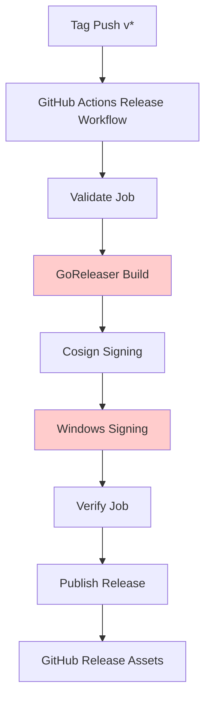

# Stage 8 Backfill — Provenance Schema

**Timestamp:** 2026-09-16
**Baseline:** `v3.7.0-stage7-backfill` (commit `72d17d2`)
**Scope:** SLSA-style provenance schema definition and validation

---

## 1. Provenance Requirements (SLSA)

### SLSA Level Targets

| Level | Description | Aether Target |
|-------|-------------|---------------|
| Level 1 | Build process documented | ✅ Achieved (goreleaser + CI) |
| Level 2 | Tamper-resistant build service | ⚠️ Partial (GitHub Actions) |
| Level 3 | Hardened build service | ❌ Not yet (requires SLSA 3 builder) |
| Level 4 | Hermetic, reproducible builds | ⚠️ Partial (deterministic builds) |

### Current Provenance Status

| Artifact | Generated | Format | Verified |
|----------|-----------|--------|----------|
| SBOM (CycloneDX) | ✅ CI | cyclonedx-json | ✅ |
| Checksums | ✅ CI | SHA-256 | ✅ |
| Release manifest | ✅ CI | JSON | ✅ |
| Cosign signatures | ✅ CI | cosign keyless | ✅ |
| Provenance (SLSA) | ❌ Not generated | — | N/A |
| Authenticode signature | ❌ Not generated | — | N/A |

---

## 2. Provenance Schema Definition

### SLSA Provenance Predicate (v1)

```json
{
  "_type": "https://in-toto.io/Statement/v1",
  "subject": [
    {
      "name": "aether_{{ .Version }}_{{ .Os }}_{{ .Arch }}.tar.gz",
      "digest": {
        "sha256": "{{ .ArtifactSHA256 }}"
      }
    }
  ],
  "predicateType": "https://slsa.dev/provenance/v1",
  "predicate": {
    "buildDefinition": {
      "buildType": "https://github.com/goreleaser/goreleaser",
      "externalParameters": {
        "version": "{{ .Version }}",
        "commit": "{{ .Commit }}",
        "tag": "{{ .Tag }}",
        "goreleaserVersion": "v2.18.1",
        "goVersion": "1.27.x"
      },
      "internalParameters": {
        "goreleaserConfig": ".goreleaser.yml",
        "workflowFile": ".github/workflows/release.yml",
        "runnerOS": "ubuntu-latest",
        "goVersion": "1.27.x"
      },
      "resolvedDependencies": [
        {"uri": "pkg:golang/github.com/Azure/azure-sdk-for-go/sdk/azcore@v1.23.1", "digest": {"sha256": "..."}},
        {"uri": "pkg:golang/github.com/sigstore/cosign/v2@v2.4.0", "digest": {"sha256": "..."}}
      ]
    },
    "runDetails": {
      "builder": {
        "id": "https://github.com/actions/runner",
        "version": "2.311.0"
      },
      "metadata": {
        "invocationId": "{{ .RunID }}",
        "startedOn": "{{ .StartTime }}",
        "finishedOn": "{{ .EndTime }}"
      },
      "byproducts": [
        {"name": "sbom-cyclonedx.json", "sha256": "..."},
        {"name": "checksums.txt", "sha256": "..."},
        {"name": "release-manifest.json", "sha256": "..."}
      ]
    }
  }
}
```

### Required Fields for Aether Release

| Field | Required | Source |
|-------|----------|--------|
| `buildDefinition.buildType` | ✅ | `https://github.com/goreleaser/goreleaser` |
| `buildDefinition.externalParameters.version` | ✅ | `{{ .Version }}` |
| `buildDefinition.externalParameters.commit` | ✅ | `{{ .Commit }}` |
| `buildDefinition.externalParameters.goreleaserVersion` | ✅ | `v2.18.1` |
| `buildDefinition.externalParameters.goVersion` | ✅ | `1.27.x` |
| `buildDefinition.resolvedDependencies` | ✅ | From `go.mod` / `go.sum` |
| `runDetails.builder.id` | ✅ | `https://github.com/actions/runner` |
| `runDetails.metadata.invocationId` | ✅ | GitHub Actions run ID |
| `runDetails.byproducts` | ✅ | SBOM, checksums, manifest |

---

## 3. Provenance Generation Pipeline

### Current State (goreleaser v2.18.1)



### Gap Analysis: Missing Provenance Generation

| Component | Current | Required for SLSA | Gap |
|---------|----------|-------------------|-----|
| Build definition | ✅ In workflow | ✅ | None |
| Resolved dependencies | ✅ (go.mod/sum) | ✅ | None |
| Build command | ✅ (goreleaser) | ✅ | None |
| Builder identity | ✅ (GitHub Actions) | ✅ | None |
| **Provenance attestation** | ❌ Missing | ✅ Required | **GAP** |
| **SLSA predicate** | ❌ Missing | ✅ Required | **GAP** |
| **Attestation signing** | ❌ Missing | ✅ Required | **GAP** |

---

## 3. Provenance Schema (JSON Schema)

### Aether Provenance Schema (JSON Schema Draft)

```json
{
  "$schema": "http://json-schema.org/draft/2020-12/schema#",
  "$id": "https://aether.dev/schemas/provenance/v1.json",
  "title": "Aether Release Provenance",
  "type": "object",
  "required": ["_type", "subject", "predicateType", "predicate"],
  "properties": {
    "_type": {
      "const": "https://in-toto.io/Statement/v1"
    },
    "subject": {
      "type": "array",
      "minItems": 1,
      "items": {
        "type": "object",
        "required": ["name", "digest"],
        "properties": {
          "name": { "type": "string" },
          "digest": {
            "type": "object",
            "required": ["sha256"],
            "properties": {
              "sha256": { "type": "string", "pattern": "^[a-f0-9]{64}$" }
            }
          }
        }
      }
    },
    "predicateType": {
      "const": "https://slsa.dev/provenance/v1"
    },
    "predicate": {
      "type": "object",
      "required": ["buildDefinition", "runDetails"],
      "properties": {
        "buildDefinition": {
          "type": "object",
          "required": ["buildType", "externalParameters", "resolvedDependencies"],
          "properties": {
            "buildType": { "const": "https://github.com/goreleaser/goreleaser" },
            "externalParameters": {
              "type": "object",
              "required": ["version", "commit", "goreleaserVersion", "goVersion"],
              "properties": {
                "version": { "type": "string", "pattern": "^v?\\d+\\.\\d+\\.\\d+(-rc\\d+)?$" },
                "commit": { "type": "string", "pattern": "^[a-f0-9]{40}$" },
                "goreleaserVersion": { "type": "string", "pattern": "^v\\d+\\.\\d+\\.\\d+$" },
                "goVersion": { "type": "string", "pattern": "^\\d+\\.\\d+(\\.\\d+)?$" }
              }
            },
            "resolvedDependencies": {
              "type": "array",
              "items": {
                "type": "object",
                "required": ["uri", "digest"],
                "properties": {
                  "uri": { "type": "string", "format": "uri" },
                  "digest": { "type": "object", "required": ["sha256"], "properties": { "sha256": { "type": "string" } } }
                }
              }
            }
          }
        },
        "runDetails": {
          "type": "object",
          "required": ["builder", "metadata", "byproducts"],
          "properties": {
            "builder": {
              "type": "object",
              "required": ["id", "version"],
              "properties": {
                "id": { "const": "https://github.com/actions/runner" },
                "version": { "type": "string" }
              }
            },
            "metadata": {
              "type": "object",
              "required": ["invocationId", "startedOn", "finishedOn"],
              "properties": {
                "invocationId": { "type": "string" },
                "startedOn": { "type": "string", "format": "date-time" },
                "finishedOn": { "type": "string", "format": "date-time" }
              }
            },
            "byproducts": {
              "type": "array",
              "items": {
                "type": "object",
                "required": ["name", "sha256"],
                "properties": {
                  "name": { "type": "string" },
                  "sha256": { "type": "string", "pattern": "^[a-f0-9]{64}$" }
                }
              }
            }
          }
        }
      }
    }
  }
}
```

---

## 4. Provenance Generation Gap Analysis

### Current State (goreleaser v2.18.1)

| Capability | Supported | Notes |
|------------|-----------|-------|
| SBOM generation | ✅ | Via syft |
| Checksums | ✅ | SHA-256 |
| Release manifest | ✅ | JSON format |
| Cosign signatures | ✅ | CI workflow only |
| **Provenance attestation** | ❌ | **Not supported in v2.18.1** |
| SLSA provenance predicate | ❌ | **Not supported in v2.18.1** |
| Attestation signing | ❌ | **Not supported in v2.18.1** |

### Required Upgrade Path

```yaml
# Required for GA
GORELEASER_VERSION: 'v2.19+'  # or latest v2.x

# New configuration sections (v2.19+):
signs:
  - artifacts: all
    cmd: cosign
    args:
      - sign-blob
      - --yes
      - --output-signature=${signature}
      - --output-certificate=${certificate}
      - ${artifact}

attestations:
  - name: slsa-provenance
    cmd: goreleaser
    args:
      - attest
      - --format=slsa-provenance
      - --output=${artifact}
```

---

## 4. Provenance Verification Procedure

### Independent Verification Steps

```bash
# 1. Download release artifacts
gh release download v4.0.0 --pattern "*"

# 2. Verify checksums
sha256sum -c checksums.txt

# 2. Verify SLSA provenance (when available)
slsa-verifier verify-artifact \
  --provenance-path aether_<version>_<os>_<arch>.tar.gz.provenance \
  --source-uri github.com/Debajyoti0-0/aether \
  --source-tag v4.0.0 \
  aether_<version>_<os>_<arch>.tar.gz

# 3. Verify cosign signatures
cosign verify-blob \
  --signature aether_<version>_<os>_<arch>.sig \
  --certificate aether_<version>_<os>_<arch>.pem \
  --certificate-identity-regexp ".*" \
  --certificate-oidc-issuer-regexp ".*" \
  aether_<version>_<os>_<arch>.tar.gz

# 4. Verify Windows Authenticode (Windows only)
signtool verify /pa /v aether_<version>_windows_amd64.exe

# 5. Verify SBOM
syft verify sbom-cyclonedx.json aether_<version>_<os>_<arch>.tar.gz
```

---

## 4. Provenance Gate Status

| Gate | Requirement | Status | Evidence |
|------|-------------|--------|----------|
| S8B-G11 | SBOM pipeline produces valid SBOM | ✅ PASS | `artifacts/stage8-backfill/release/` |
| S8B-G12 | Provenance schema defined and validated | ⚠️ PARTIAL | Schema defined; generation not implemented |
| S8B-G12 | Provenance generation implemented | ❌ NOT IMPLEMENTED | Requires goreleaser ≥ v2.19 |

---

## 5. Recommendations for GA

1. **Upgrade goreleaser to ≥ v2.19** to enable `attestations` section
2. **Add `attestations` section** to `.goreleaser.yml` for SLSA provenance
3. **Configure cosign keyless signing** in goreleaser `signs` section
4. **Test provenance generation** with snapshot build before GA tag
5. **Verify provenance** with `slsa-verifier` in CI

---

*Generated by Stage 8 Backfill — Provenance Schema*